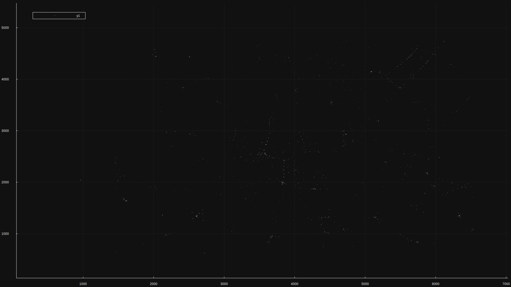

# UTC_jl
<div id="top"></div>

<!-- PROJECT LOGO -->
<br />
<div align="center">
  <h3 align="center">Urban Traffic Control (julia)</h3>

  <p align="center">
  Semestral project of <a href="https://juliateachingctu.github.io/Scientific-Programming-in-Julia/dev/">SPJ</a>
  </p>
</div>

<!-- TABLE OF CONTENTS -->
<details>
  <summary>Table of Contents</summary>
  <ol>
    <li>
      <a href="#about-the-project">About The Project</a>
    </li>
    <li>
      <a href="#getting-started">Getting Started</a>
      <ul>
        <li><a href="#packages">Packages</a></li>
        <li><a href="#installation">Installation</a></li>
      </ul>
    </li>
   <li>
      <a href="#algorithms">Algorithm</a>
    </li>
    <li>
      <a href="#benchmarks">Benchmarks</a>
      <ul>
        <li><a href="#cuda">CUDA</a></li>
        <li><a href="#cpu">CPU</a></li>
      </ul>
    </li>
    <li>
      <a href="#usage">Usage</a>
      <ul>
        <li><a href="#description">Description</a></li>
        <li><a href="#example">Examples</a></li>
        <li><a href="#visualization">Visualization</a></li>
      </ul>
    </li>
    <li>
      <a href="#references">References</a>
    </li>
  </ol>
</details>


<!-- ABOUT THE PROJECT -->
## About The Project
This project is a semestral task for Julia language. The project contains the initial implementation of working with simulator SUMO networks and clustering algorithm to find "problematic" (highly congested) sub-regions inside the network. It functions as trial / comparison against the original python implementation, it is compared in terms of speed and functionality.

<p align="right">(<a href="#top">back to top</a>)</p>

<!-- GETTING STARTED -->
## Getting Started
The inteded use of this project is mostly for demonstration purposes, however the algorithms and implementation of them is made more general, however the road networks must be obtained either from the official SUMO [site](https://eclipse.dev/sumo/) and the needed statistical files generated by it.

### Packages

1) [BenchmarkTools](https://github.com/djsegal/julia_packages)
2) [XML](https://github.com/djsegal/julia_packages)
3) [Plots](https://docs.juliaplots.org/latest/) 
4) [CUDA](https://github.com/djsegal/julia_packages)
4) [Random](https://github.com/djsegal/julia_packages)

### Installation

<p align="right">(<a href="#top">back to top</a>)</p>

Use [Pkg](https://docs.julialang.org/en/v1/stdlib/Pkg/) to install project from GitHub, or download the project and activate the enviroment inside root, then it can be used similary (Do not forget to install the required libraries or use "Pkg.initiaite()").
```julia
(env) pkg> add https://github.com/Matyxus/UTC_jl
```
** Note: If we wish to run clustering with multiple threads, start the
julia interpreter with the option: "--threads=NUM".


## Algorithm
<p align="right">(<a href="#top">back to top</a>)</p>
The main feature of this work is the "gravitational" clustering algorithm. The goal of this algorithm, is to cluster points (in 2D space) given their positions, weights and radius (minimal distance between points) for merging. The implementation can be split into two pars:

1) Calculation of movements: in this part, attraction between points is computed, it is done as each point against all others. The formula used is: "attraction = weights / distances (squared)". It has greate potential to be parallelized and/or computed quickly on GPU.

2) Clustering (original): The initial algorithm (based on the python implementation) perform while loop on the matrix of points and for each point computs the destination against all others. All points that have distance lesser than that of radius are considered as being "absorbed" by the current point. The current point (or one of the others, depending on the maximal weight) becomes the cluster leader and is moved to the center of gravity of all of these points. Clusters are merged together (all points are initially in the their own cluster) and the new cluster also increases its own weight as the total sum of absorbed points / clusters, which are then removed from the point matrix. 

2) Clustering (new): The usual approach to such problem (especially in physics simulators) is to smartly [partition](https://en.wikipedia.org/wiki/Space_partitioning) the space, so that we do not need to compare the distance against all other points. In this work, it is done by simple uniform grid, in a way that guarantees, that 3x3 grid radius is searched at most for given grid cell. This is done by performing counting sort on pair of coordinates and their grid cells (sorting by cell id), then mapping the grid cell id to the starting index of the sorted array, where the grid cell can be first found. Constructing the grid is not hard, as the bounding box can be found in parallel, and the counting sort runs pretty much in linear time, ofcourse the space requirement is not optimal, as we need output array and the array for the grid paritioning, that can have large size, depending on the given radius and highest/lowest coordinates. The merging is done in similar way, however the cells which are in the same cell are only visited once, this leads to a bit different merging process, however if the given weights are not too large (points are not moving too much) it does even out with the original implementation eventually. 

<p align="right">(<a href="#top">back to top</a>)</p>

## Benchmarks

### CUDA
<table>
  <thead>
      <tr>
          <th></th>
          <th>Classic for cycle</th>
          <th>Classic for cycle with diff save</th>
          <th>Vectorized</th>
      </tr>
  </thead>
  <tbody>
      <tr>
          <td>non-CUDA</td>
          <td><strong>151.924 ms</strong> (112767 allocations: 843.90 MiB)</td>
          <td><strong>230.574 ms</strong> (119400 allocations: 1.15 GiB)</td>
          <td><strong>706.795 ms</strong> (34 allocations: 1.31 GiB)</td>
      </tr>
      <tr>
          <td>CUDA with scalar indexing</td>
          <td><strong>1.718 s</strong> (1742058 allocations: 80.88 MiB)</td>
          <td><strong>1.682 s</strong> (1745740 allocations: 78.27 MiB)</td>
          <td><strong>536.556 ms</strong> (7194 allocations: 715.34 KiB)</td>
      </tr>
      <tr>
          <td>CUDA with bool indexing</td>
          <td><strong>1.806 s</strong> (2011188 allocations: 134.55 MiB)</td>
          <td><strong>1.908 s</strong> (1963944 allocations: 130.14 MiB)</td>
          <td><strong>84.939 ms</strong> (231 allocations: 42.27 MiB)</td>
      </tr>
  </tbody>
</table>

### CPU

<!-- USAGE EXAMPLES -->
## Usage
### Description
### Example
### Visualization
There are multiple visualization methods provided for this work, 
first one being the plotting of networks in the SUMO format:


Second one for visualization of congestion indexes (extracted by SUMO in statistical files):

** The more red the edge is, the more congestion was observed there.


Finally the visualization of clustering (which can be shown as points, or as clusters):


<p align="right">(<a href="#top">back to top</a>)</p>

## References
1) [FAST FIXED-RADIUS NEAREST NEIGHBORS](https://on-demand.gputechconf.com/gtc/2014/presentations/S4117-fast-fixed-radius-nearest-neighbor-gpu.pdf)
2) [Particle Simulation using CUDA](https://developer.download.nvidia.com/assets/cuda/files/particles.pdf)

<p align="right">(<a href="#top">back to top</a>)</p>

